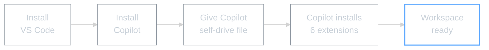

# Module 00: Copilot + VS Code Setup

## WHY -- Why This Matters

Before you can use AI tools, you need a workspace that's set up properly. VS Code is that workspace. GitHub Copilot is the tool that sets it up for you.

**Important framing:** Copilot is your **setup tool**. It installs extensions, configures your theme, and gets VS Code ready. From Module 1 onwards, **Claude Code CLI** is the main tool you'll use for building.

Think of it this way:
- **Copilot** = The person who sets up your desk on day one
- **Claude Code** = The colleague who works alongside you every day

---

## WHAT -- What You'll Learn

How to use Copilot to configure a complete AI-powered workspace in under 10 minutes.

### The 6 Extensions (hardcoded -- no more, no less)

| # | Extension ID | What It Does |
|---|-------------|-------------|
| 1 | `github.copilot` | AI coding assistant (free tier: 100 tasks/month) |
| 2 | `github.copilot-chat` | Copilot chat panel inside VS Code |
| 3 | `anthropic.claude-code` | Claude Code -- the main AI tool from Module 1 |
| 4 | `akamud.vscode-theme-onedark` | One Dark theme (easy on the eyes) |
| 5 | `cweijan.vscode-office` | View PDFs, markdown (WYSIWYG), and xlsx files |
| 6 | `yzhang.markdown-all-in-one` | Markdown shortcuts + table of contents |

### What You Need Before Starting
- VS Code installed (free from code.visualstudio.com)
- A GitHub account (free)
- Internet connection

---

## HOW -- The Self-Drive Process

Same cycle as every module:

1. **You read** this README (done)
2. **You give Copilot the self-drive file** -- open `COPILOT-SELF-DRIVE.md`, copy the contents, paste into Copilot Chat
3. **Copilot builds** -- it installs all 6 extensions, sets your theme, and verifies everything works

### Making VS Code Feel Like Home

Once Copilot finishes the setup, these four tweaks make VS Code feel less like a code editor:

1. **Theme** -- One Dark is already installed. If you want something different, Command Palette (Cmd+Shift+P) -> "Color Theme"
2. **File icons** -- The Office extension gives you familiar icons for PDFs, spreadsheets, etc.
3. **Sidebar** -- Pin your project folder in the Explorer. Hide panels you don't use
4. **Font size** -- Cmd+Plus (Mac) / Ctrl+Plus (Windows) to zoom in until it feels comfortable

When it's personalised, it stops feeling like software and starts feeling like home.

### Quick Reference

| What | Where |
|------|-------|
| Copilot Chat | Sidebar: Cmd+Shift+I (Mac) / Ctrl+Shift+I (Windows) |
| Command Palette | Cmd+Shift+P (Mac) / Ctrl+Shift+P (Windows) |
| Settings | Cmd+, (Mac) / Ctrl+, (Windows) |
| Agent Mode | Switch in Copilot chat dropdown menu |

### Troubleshooting

| Problem | Fix |
|---------|-----|
| Copilot won't install | Update VS Code to latest version, check GitHub sign-in |
| Can't authenticate | Click "Sign in" when prompted, approve in browser, return to VS Code |
| Extensions not appearing | Make sure you're in Agent mode, restart VS Code |

Also see `COPILOT-CHEATSHEET.pdf` in this folder for a full troubleshooting guide.

---

## WHAT IF -- What This Unlocks

Your workspace is now ready for the real work. From here:

- **Module 000** -- Install Claude Code CLI (the tool that does the heavy lifting)
- **Module 1** -- Create your `CLAUDE.md` file (custom instructions for Claude Code)
- **Module 2** -- Set up a Master Log (session continuity)
- **Module 3** -- Slash commands, skills, and Plan Mode (speed and control)
- **Module 4** -- MCPs (connect Claude to external services)
- **Module 5** -- AI agents (autonomous specialists)

Copilot stays available for quick tasks, but Claude Code is where the power is.

---

*Module 00 | AI Workshop Curriculum | SSL 2026*
