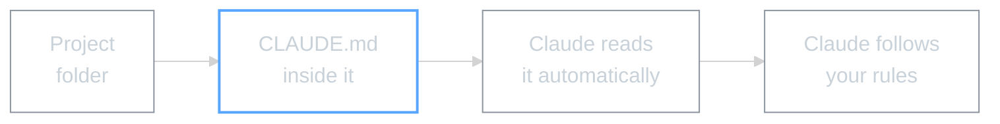

# Module 1: Your Project's Brain -- CLAUDE.md

## WHY -- Why This Matters

Every time you start a conversation with Claude Code, it looks for a file called `CLAUDE.md` in your project folder. Without it, you're repeating yourself every session -- "use UK English", "keep it brief", "don't change my files without asking".

With a CLAUDE.md, Claude already knows you:
- **Your communication style** -- UK English, concise, no jargon
- **Your preferences** -- what to do when you say certain things
- **Your rules** -- format, structure, what to ask before doing

**Before:** You repeat yourself every conversation.
**After:** Claude reads your rules once and follows them automatically.

---

## WHAT -- What You'll Learn

How to create a CLAUDE.md file that acts as your project's instruction manual for Claude.



### What Goes in Your CLAUDE.md

| Section | What It Does | Example |
|---------|-------------|---------|
| About This Project | Reminds Claude what you're working on | "Amazon product research for kitchen niche" |
| Communication Style | How Claude should talk to you | "UK English, brief, no waffle" |
| Intent Mapping | "When I say X, you do Y" | "find the report" -> Claude searches your files |
| Format Rules | How output should look | "Tables for data, short paragraphs, TL;DR first" |
| My Preferences | Rules you want Claude to follow | "Always ask before changing spreadsheets" |

### Example: Amazon Seller's CLAUDE.md

```markdown
# CLAUDE.md

This file tells Claude how to work on this project.

## About This Project

**Project:** Amazon Kitchen Niche Research
**Main Goal:** Find profitable products and create listings

## How Claude Should Communicate

- Use UK English spelling (colour, organise, catalogue)
- Keep responses brief and actionable
- No marketing fluff -- just the facts
- When analysing data, show me the numbers first

## Intent Mapping

| I say | You do |
|-------|--------|
| "find [something]" | Search the project for matching files |
| "summarise this" | Key points first, skip the waffle |
| "check the numbers" | Open the spreadsheet, show a summary table |

## Format Rules

- Tables for data under 10 rows
- Short paragraphs (3-4 lines max)
- Always include search volume when suggesting keywords

## My Preferences

- Don't change my spreadsheets without asking
- When writing listings, focus on benefits not features
```

---

## HOW -- The Self-Drive Process

> **Where does CLAUDE.md go?**
>
> Your CLAUDE.md file goes **inside your project folder** -- the folder you pick in the Code tab. For example: `~/my-amazon-project/CLAUDE.md`
>
> **NOT** in `~/.claude/` -- that's a different system folder. If you put it there, Claude won't find it when you're working on your project.
>
> Quick check: your CLAUDE.md should be in the **same folder** as your other project files.

1. **You read** this README (done)
2. **You give Claude the file** -- drag `MODULE-1-GIVE-TO-CLAUDE.md` into the Code tab chat, with the line printed at the top of it
3. **Claude asks you 3 questions** -- what's your project, what do you need help with, how should Claude communicate
4. **Claude creates your CLAUDE.md** -- tailored to your answers

### Tips

- **Start simple** -- you can always add more rules later
- **Add as you go** -- when Claude does something you don't like, add a rule
- **Be specific** -- "UK English" is better than "write properly"
- **Test it** -- start a new conversation and see if Claude follows your rules

### Common Questions

| Question | Answer |
|----------|--------|
| Where does the file go? | In your project folder -- the folder you open in Claude Code |
| Different files per project? | Yes. Each project folder can have its own CLAUDE.md |
| How do I update it? | Edit the file directly, or ask Claude to add something |
| Can I see what's in it? | Ask Claude "What are my preferences?" |

There's also a test folder (`TEST-CLAUDE-MD/`) with a sample CLAUDE.md you can look at.

---

## WHAT IF -- What This Unlocks

Your CLAUDE.md is the foundation everything else builds on. From here:

- **Module 2** -- Add a Master Log so Claude remembers what you worked on across sessions (session memory)
- **Module 3** -- Create slash commands, skills, and use Plan Mode (speed and control)
- **Module 4** -- Connect Claude to external services with MCPs (calendars, browsers, files)

The CLAUDE.md stays with your project forever. Every new feature you add in later modules builds on top of it.

---

*Module 1 | AI Workshop Curriculum | SSL 2026*
