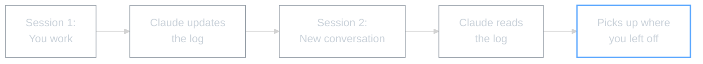

# Module 2: Master Session Log

## WHY -- Why This Matters

Every time you start a new conversation with Claude Code, it's like meeting someone new. Claude doesn't remember what you worked on yesterday, what decisions you made, or what research you did.

Your Master Session Log fixes this. It's a single file where Claude records what you do together -- and reads it at the start of each session to remember.

**Before:** "Where were we?" every single session.
**After:** Claude reads the log and picks up instantly.

---

## WHAT -- What You'll Learn

How to set up a log file that gives Claude session memory -- so your progress, decisions, and research survive between conversations.

### What Gets Tracked

| Type | Example Entry |
|------|---------------|
| **Research** | "Found 3 potential suppliers on Alibaba -- pricing summary below" |
| **Decisions** | "Decided to focus on UK market first before US expansion" |
| **Files** | "Created competitor-analysis.md" |
| **Next steps** | "Need to follow up with supplier B about MOQ" |
| **Problems** | "Website scraping blocked -- trying different approach next time" |

### How Is This Different from CLAUDE.md?

| Module 1: CLAUDE.md | Module 2: Master Log |
|---------------------|----------------------|
| How you like to work | What you've actually done |
| Your preferences | Your progress |
| Rarely changes | Updates every session |
| "Who you are" | "Where you've been" |

They work together. CLAUDE.md tells Claude how to communicate. The Master Log tells Claude what you've been working on.

---

## HOW -- The Self-Drive Process

1. **You read** this README (done)
2. **You give Claude the self-drive file** -- open `MASTER-LOG-SELF-DRIVE.md`, copy the contents, paste into Claude Code
3. **Claude asks you 3 questions** -- what to call the log, where to save it, what to track
4. **Claude creates your Master Session Log** -- ready to use

### Using It Day to Day

**End of each session:**
> "Update the session log"

**Start of the next session:**
> "Read the session log -- what did we do last time?"

**Finding past work:**
> "What research did we do on [topic]?"

### Tips

- **Keep entries scannable** -- bullet points, clear dates, short summaries
- **Update regularly** -- quick update at end of each session, don't let it pile up
- **Be specific** -- "Researched 5 Alibaba suppliers for silicone cases, shortlisted 2" beats "did some research"
- **Newest first** -- new entries go at the top so the most recent work is always visible

### Common Questions

| Question | Answer |
|----------|--------|
| How big will it get? | Grows slowly. Archive older entries after a few months if needed |
| What if I forget to update? | Ask Claude to "summarise what we did and add it to the log" at any point |
| Multiple logs? | One per project works well, or one master log for everything |
| Will Claude definitely remember? | As long as you mention the log at session start, yes |

---

## WHAT IF -- What This Unlocks

With CLAUDE.md (Module 1) and a Master Log (this module), Claude now knows:
- **Who you are** -- your preferences and communication style
- **Where you've been** -- your progress, decisions, and research

From here:
- **Module 3** -- Slash commands, skills, and Plan Mode (speed up your workflow)
- **Module 4** -- MCPs (connect Claude to calendars, browsers, files)
- **Module 5** -- AI agents (autonomous specialists for Amazon tasks)

---

*Module 2 | AI Workshop Curriculum | SSL 2026*
