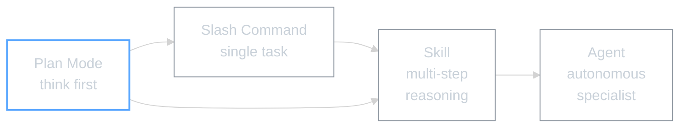

# Module 3: Slash Commands, Skills, and Plan Mode

## WHY -- Why This Matters

You find yourself typing the same requests to Claude over and over: "update the log", "find that file", "summarise what we did". That's wasted time and mental energy.

This module gives you three layers of control:

1. **Slash commands** -- shortcuts for tasks you repeat (type `/log` instead of a paragraph)
2. **Skills** -- multi-step reasoning that commands can't do alone (like researching a topic from the web)
3. **Plan Mode** -- a "think before you build" workflow for anything non-trivial



**Before:** You type out full requests every time.
**After:** `/log` does it in one second. `/web-researcher` gathers information from any website. Plan Mode stops Claude from rushing ahead.

---

## WHAT -- What You'll Learn

### Part 1: Slash Commands

Slash commands are shortcuts stored as `.md` files. The file name becomes the command name.

```
your-project/
├── CLAUDE.md
├── MASTER-SESSION-LOG.md
└── .claude/
    └── commands/
        ├── status.md      →  /status
        ├── log.md          →  /log
        └── find.md         →  /find
```

Each file contains a description + a prompt. That's it.

**Anatomy of a command:**
```markdown
---
description: What this command does (shows in help)
---

The prompt that Claude runs when you type the command.
Use $ARGUMENTS for whatever the user types after the command name.
```

| Example | What It Does |
|---------|-------------|
| `/status` | Quick project health check |
| `/log` | Update the session log |
| `/find keyword research` | Search for files matching a description |
| `/summarise` | Bullet-point summary of the session |

### Part 2: Skills

A skill is like a slash command with brains. Where a command runs a single prompt, a skill does multi-step reasoning -- it reads files, checks context, makes decisions, then gives you a result.

You get 3 starter skills with this module:

| Skill | What It Does | When to Use It |
|-------|-------------|----------------|
| `/find` | Searches your project using plain English | "find the supplier spreadsheet" |
| `/web-researcher` | Researches any topic or URL from the web | "research competitor pricing strategies" |
| `/content-research-writer` | Writing partner that helps you draft from source material | Turn research into an article |

**The chain:** Research a topic -> feed it to the content writer -> get a polished article. Skills working together is where the real power is.

Skills live in `.claude/skills/` (not `.claude/commands/`). Copy the 3 files from this module's `skills/` folder into your project's `.claude/skills/` folder.

```
your-project/
└── .claude/
    ├── commands/       ← slash commands (simple)
    └── skills/         ← skills (multi-step)
        ├── find.md
        ├── web-researcher.md
        └── content-research-writer.md
```

### Part 3: Plan Mode

Plan Mode is a workflow toggle that says: "Think before you build."

**How it works:**
1. Ask Claude to switch to plan mode
2. Claude analyses, outlines, and proposes a plan
3. You review and approve (or adjust)
4. Claude executes the approved plan
5. Back to Plan Mode for the next thing

**When to use it:**
- Anything that changes multiple files
- Tasks where the approach isn't obvious
- When you want to understand what Claude will do before it does it

**When to skip it:**
- Quick fixes (typos, small edits)
- Simple questions
- Tasks where you've given very specific instructions

The cycle: **Plan -> Approve -> Execute -> Back to Plan**

This prevents Claude from rushing ahead and making changes you didn't expect. It's the single best habit for staying in control.

---

## HOW -- The Self-Drive Process

### Setting Up Slash Commands

1. **You read** this README (done)
2. **You give Claude the self-drive file** -- open `SLASH-COMMANDS-SELF-DRIVE.md`, copy the contents, paste into Claude Code
3. **Claude asks you 3 questions** -- what tasks you repeat, where your folder is, which command to create first
4. **Claude creates your commands folder** and first commands

### Installing the 3 Skills

Copy the skill files from this module into your project:

1. Open the `skills/` folder in this module
2. Copy all 3 files (`find.md`, `web-researcher.md`, `content-research-writer.md`)
3. Paste them into your project's `.claude/skills/` folder
4. If the folder doesn't exist, create it: `.claude/skills/`
5. **Restart Claude Code** after copying the files (skills load at startup)

Or ask Claude: "Create a `.claude/skills/` folder and copy these skill files into it."

**Verify it worked:** Type `/web-researcher` in Claude Code. If it appears in the list, you're set. If it doesn't, restart Claude Code -- skills are registered when Claude starts up.

### Tips

- **One command = one job.** Don't try to do everything in one command
- **Clear names.** `/log`, `/status`, `/find` -- not `/cmd1`, `/process`
- **Test each command once** before relying on it
- **Start with Plan Mode** for anything beyond a quick fix
- **Skills not showing up?** Restart Claude Code. Skills in `.claude/skills/` are loaded at startup, not mid-conversation

### Common Questions

| Question | Answer |
|----------|--------|
| Where does `.claude/` go? | In your project root, same level as CLAUDE.md |
| Different commands per project? | Yes, each project has its own `.claude/commands/` |
| What if I type a command that doesn't exist? | Claude tells you. No harm done |
| How many commands can I have? | As many as you like. Most people use 5-10 regularly |
| Commands vs skills? | Commands = single prompt. Skills = multi-step reasoning |

Also see `ADDITIONAL-RESOURCES/` for a full reference of built-in slash commands.

---

## WHAT IF -- What This Unlocks

You now have three layers of control:
- **CLAUDE.md** (Module 1) -- who you are
- **Master Log** (Module 2) -- where you've been
- **Commands + Skills + Plan Mode** (this module) -- how you work fast and stay in control

From here:
- **Module 4** -- MCPs connect Claude to external services (calendars, browsers, files on your computer)
- **Module 5** -- AI agents that work autonomously on Amazon-specific tasks

---

*Module 3 | AI Workshop Curriculum | SSL 2026*
