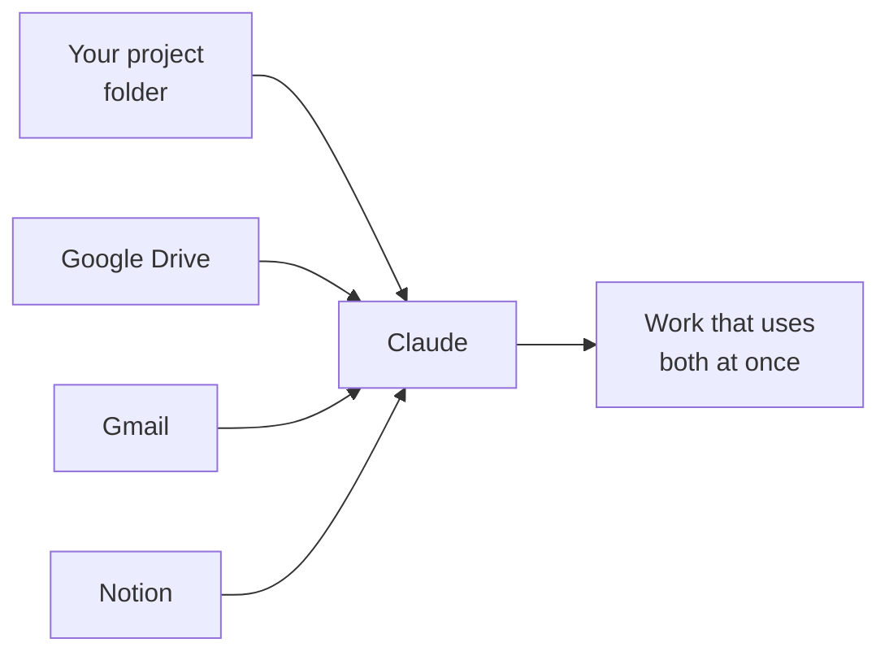

# Module 4: Connectors

Everything so far has happened inside one folder. This module lets Claude reach outside it.

## The idea in one line

A connector is a door between Claude and a service you already use, such as your Drive, your email or your notes.

Without one, Claude only knows the files in the folder you picked. With one, you can ask it to read a document from Drive, pull the details out of an email, or check a page in Notion, and then do something with what it found.

## The one rule worth remembering

**Connectors follow you. A project's settings stay with the folder.**

A connector is switched on for your account, so it is there in every session, in every folder, on every machine you sign into. That is different from the files you made in Modules 1, 2 and 3, which belong to one folder and travel only if the folder does.

People get caught out by this in both directions. They expect a connector to be missing in a new project and it is there. Or they expect their commands and agents to appear everywhere and those stay behind in the folder.

## Turn one on

You only need one to learn the pattern. This walkthrough uses Google Drive because most people already have it.

1. Go to **claude.ai** in your browser and sign in.
2. Open **Settings**, then **Connectors**.
3. Find **Google Drive** in the list and click to add it.
4. Google asks you to sign in and to approve the access. Approve it.
5. Come back to Claude Desktop and start a new session in the Code tab.

If Google Drive is not in your list, use **Gmail** or **Notion** instead. The steps are identical and the rest of this module works the same way.

## Check it worked

In your Code tab session, ask Claude:

> Which tools do you have connected?

Claude lists what it can reach. Your new connector should be in that list. If it is not, start a fresh session and ask again, because a session picks up connectors when it opens.

## Try it

Ask Claude to do something small that needs the connector, then something that combines it with your folder:

- **On its own:** "List the files in my Drive folder called Marketing."
- **Combined:** "Read the strategy document in that folder and summarise it into a new file in this project."

The second one is the point of the module. Claude reached outside, brought something back, and wrote it into your project.

## Others to try

No instructions for these. Add them the same way, one at a time, and ask Claude what it can do with each.

Gmail. Notion. Google Calendar. Whatever else appears in your connector list.

Add them when you have a use for one. A connector you never use is just another thing switched on.

## Going further

There is a second way to give Claude tools, set per folder rather than per account, using a file called `.mcp.json`. It reaches things connectors do not, such as browser automation. It also needs software installed on your machine and it is where most of the problems in the old version of this course came from.

You do not need it. If you want it later, see `ADVANCED-mcp-json.md` in this folder.
