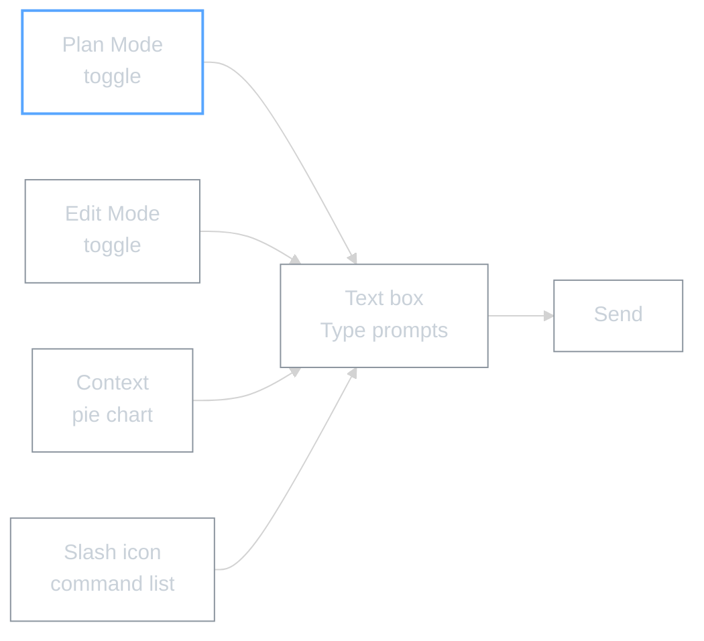

# Slash Commands for Non-Technical Users

Quick reference for the built-in commands and chat UI controls you'll use most.

---

## Essential Slash Commands

| Command | What it does | When to use it |
|---------|-------------|----------------|
| `/compact` | Shrinks long conversation history while keeping key points | When your chat is getting long and Claude starts forgetting earlier context |
| `/cost` | Shows your current usage/spend for this session | When you want to check how much you've used |
| `/review` | Runs a focused review on your current draft or content | After writing something -- get specific issues and improvements, not just "looks good" |
| `/todos` | Turns the current discussion into a simple to-do list | When a chat becomes a plan and you want clear, trackable tasks |

---

## Chat Box UI

---

## What the UI Controls Do

| Control | What it does | Plain English |
|---------|-------------|---------------|
| **Plan Mode toggle** | "Think first, then act" mode | Claude proposes a plan before making changes. You approve before it starts |
| **Edit Mode toggle** | Ask before editing / Auto | Controls whether Claude needs your permission before changing files |
| **Context pie chart** | Shows how full Claude's memory is | When the pie is nearly full, use `/compact` or start a new chat |
| **Slash icon** | Opens the command list | Click to browse all available commands instead of typing from memory |

---

*Reference sheet for Module 3 | AI Workshop Curriculum*
