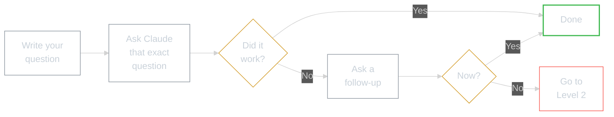
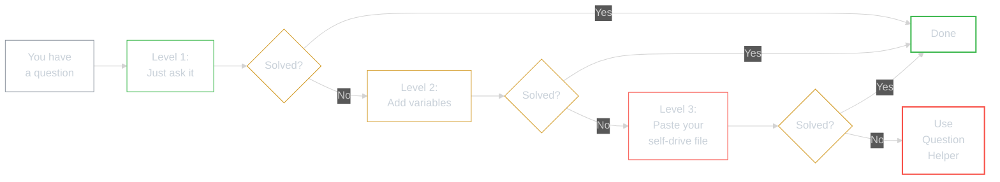

# Problem-Solving Framework for Claude Code

**The skill you're developing:** Conversational Problem-Solving with AI

---

## WHY -- Why This Matters

Most people think they need to learn "prompt engineering" to use AI. They don't. The question you'd ask a friend is already the right prompt.

The problem isn't *how* to ask -- it's what to do when the first answer doesn't work. This framework gives you a repeatable system for unsticking yourself, without needing anyone else's help.

**Before:** You get stuck, close the terminal, wait for someone to help.
**After:** You follow a 3-level system that solves 90% of problems yourself.

---

## WHAT -- What You'll Learn

A 3-level problem-solving system, from simple to advanced:


---

### Level 1: Just Ask

Your question IS the prompt. Write it exactly as you'd say it out loud.



**Follow-up phrases that work:**
- "That didn't work because..."
- "I tried that but..."
- "Can you explain that differently?"
- "I got this error: [paste the error]"

---

### Level 2: Add Context Variables

When Level 1 isn't enough, give Claude more to work with. Think of it as three variables:

```
┌───────────────────────────────────────────────────────────────────────┐
│                                                                       │
│   YOUR QUESTION  +  WHAT  +  WHERE  +  HOW                           │
│                                                                       │
│   "I'm trying to [WHAT] and I'm at [WHERE].                          │
│    Can you help me with [HOW]?"                                       │
│                                                                       │
└───────────────────────────────────────────────────────────────────────┘
```

| Variable | Ask Yourself | Examples |
|----------|-------------|----------|
| **WHAT** | What am I trying to achieve? | "Set up CLAUDE.md", "Create a command", "Install an MCP" |
| **WHERE** | Where am I in the process? | "Module 3", "Just starting", "Stuck at the install step" |
| **HOW** | How do I want the answer? | "Step by step", "Quick answer", "Explain like I'm new" |

**Example prompt:**

> "I'm trying to CREATE a slash command and I'm at Module 3. Can you give me a step-by-step guide?"

Two more variables if you're debugging:

| Variable | Ask Yourself | Examples |
|----------|-------------|----------|
| **WHY** | Why isn't it working? | "Error says...", "Nothing happens when..." |
| **CONTEXT** | What have I tried? | "I followed the steps but...", "Claude said X but..." |

---

### Level 3: Give Claude Your Self-Drive File

For maximum help, paste the self-drive file from whatever module you're working on. Claude then has the EXACT context and can help you properly.

| If You're Working On... | Give Claude This File |
|-------------------------|----------------------|
| Installing Claude Code | `Module-000.../INSTALL-SELF-DRIVE.md` |
| Setting up Copilot | `Module-00.../COPILOT-SELF-DRIVE.md` |
| Setting up CLAUDE.md | `Module-1.../CLAUDE-MD-SELF-DRIVE.md` |
| Creating your session log | `Module-2.../MASTER-LOG-SELF-DRIVE.md` |
| Commands and skills | `Module-3.../SLASH-COMMANDS-SELF-DRIVE.md` |
| Installing MCPs | `Module-4.../MCP-SELF-DRIVE.md` |
| Building agents | `Module-5.../AGENTS-SELF-DRIVE.md` |

**How:**

```
1. Open the self-drive file for your current module
2. Copy its contents
3. Paste it to Claude with your question:

   "Here's the self-drive file I'm following:

   [paste the file]

   My question is: [your question]"
```

---

### Still Stuck? Use the Question Helper

If you can't even articulate what you're asking, open `QUESTION-HELPER.pdf`, then ask Claude the question it helps you shape. Claude will walk you through a 5-step process to figure out what your question actually is.

---

## HOW -- Using This Framework



### Quick Reference Checklist

```
[ ] Did I write my question down in plain English?
[ ] Did I ask Claude that exact question? (Level 1)
[ ] Did I try a follow-up when the first answer didn't work?
[ ] Did I add WHAT / WHERE / HOW variables? (Level 2)
[ ] Did I paste my self-drive file for context? (Level 3)
[ ] Did I use the Question Helper as a last resort?
```

---

## WHAT IF -- What This Unlocks

This framework isn't just for this course. It's the same process you'll use for every AI interaction going forward:

- **At work** -- "Claude, here's my spreadsheet. The totals in column F don't match. Can you find the formula error?"
- **At home** -- "Claude, I want to organise my photos by date. What's the easiest way on Mac?"
- **In this course** -- every module gets easier because you know how to unstick yourself

The pattern never changes: **ask, refine, give context.** The more you practise it here, the more natural it becomes everywhere else.

---

*Part of AI Workshop 2.0 -- SSL 26 Edition*
